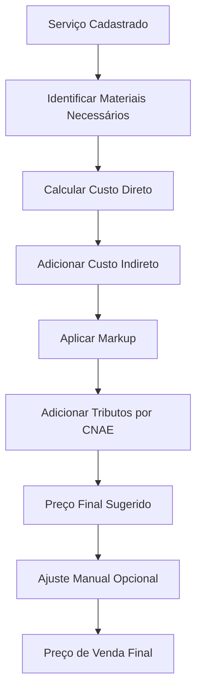
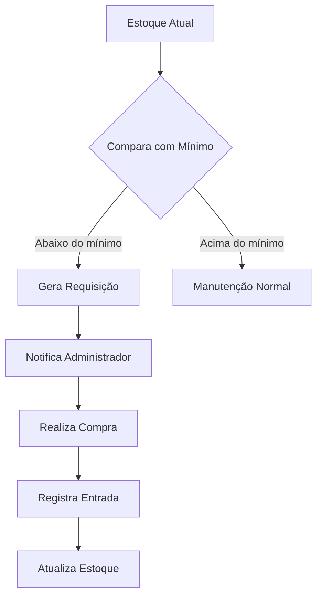

# Finesse Centro Integrado - Documento de Requisitos do Produto

## 1. Visão Geral do Produto

O Finesse Centro Integrado é um sistema completo de gerenciamento de clínica desenvolvido para otimizar operações de clínicas de estética e saúde. O sistema integra controle de serviços, materiais, custos, precificação e gestão financeira em uma plataforma unificada.

**Objetivos principais:**
- Automatizar o cálculo de custos e precificação de serviços
- Controlar estoque de materiais e insumos
- Gerenciar finanças com base em alíquotas fiscais por CNAE
- Fornecer análise de rentabilidade por serviço
- Integrar operações em um único sistema

**Público-alvo:** Clínicas de estética, spas e centros de saúde que necessitam de controle financeiro e operacional integrado.

## 2. Funcionalidades Principais

### 2.1 Papéis de Usuário

| Papel | Método de Registro | Permissões Principais |
|-------|-------------------|----------------------|
| Proprietário da Clínica | Cadastro inicial via administrador | Acesso completo a todas as funcionalidades |
| Administrador | Indicado pelo proprietário | Gerenciar serviços, materiais, usuários e relatórios |
| Funcionário | Convite por email | Registrar atendimentos, consultar serviços e materiais |

### 2.2 Módulos de Funcionalidades

O sistema Finesse Centro Integrado consiste nas seguintes páginas principais:

1. **Dashboard Principal**: Visão geral da clínica, indicadores financeiros, serviços mais rentáveis
2. **Gestão de Serviços**: Cadastro, edição e precificação de serviços oferecidos
3. **Controle de Materiais**: Gerenciamento de estoque, fornecedores e requisições
4. **Cálculo de Custos**: Análise detalhada de custos por serviço com markup automático
5. **Configuração Fiscal**: Gerenciamento de alíquotas por código CNAE
6. **Relatórios Financeiros**: Análise de rentabilidade, fluxo de caixa, DRE
7. **Autenticação**: Login, registro e controle de acesso

### 2.3 Detalhamento das Páginas

| Página | Módulo | Descrição das Funcionalidades |
|--------|--------|------------------------------|
| Dashboard Principal | Visão Geral | Exibir receita total, custos, lucro líquido, top 5 serviços mais rentáveis |
| Dashboard Principal | Indicadores | Gráficos de tendência financeira, ocupação por período |
| Gestão de Serviços | Cadastro de Serviços | Criar serviços com nome, descrição, duração, categoria |
| Gestão de Serviços | Precificação | Calcular preço baseado em custos diretos, markup e alíquota fiscal |
| Gestão de Serviços | Materiais Associados | Vincular materiais necessários por serviço com quantidades |
| Controle de Materiais | Cadastro de Materiais | Registrar materiais com unidade, custo, fornecedor, estoque mínimo |
| Controle de Materiais | Movimentação | Registrar entradas e saídas de estoque com histórico |
| Controle de Materiais | Requisição | Criar requisições de compra quando estoque abaixo do mínimo |
| Cálculo de Custos | Análise por Serviço | Detalhar custos diretos (materiais) e indiretos (mão de obra) |
| Cálculo de Custos | Markup Automático | Aplicar markup baseado em custos totais e margem desejada |
| Configuração Fiscal | CNAE Management | Cadastrar códigos CNAE com descrição e alíquota correspondente |
| Configuração Fiscal | Impostos | Configurar ISS, ICMS, PIS, COFINS, IRPJ, CSLL por CNAE |
| Relatórios Financeiros | DRE | Demonstrar receita, custos, despesas e resultado líquido |
| Relatórios Financeiros | Rentabilidade | Análise de margem de contribuição por serviço |
| Autenticação | Login | Autenticação com JWT, recuperação de senha |
| Autenticação | Registro | Cadastro de novos usuários com validação de email |

## 3. Processos Principais

### Fluxo do Proprietário
1. Acessa o sistema via login seguro
2. Configura os códigos CNAE da clínica com alíquotas fiscais
3. Cadastra materiais e insumos utilizados
4. Registra serviços oferecidos vinculando materiais necessários
5. Sistema calcula automaticamente custos e sugere preços com markup
6. Ajusta preços finais considerando mercado e concorrência
7. Acompanha indicadores financeiros e rentabilidade
8. Gera relatórios para análise gerencial

### Fluxo de Cálculo de Preço


### Fluxo de Controle de Estoque


## 4. Interface do Usuário

### 4.1 Estilo de Design
- **Cores Primárias**: Azul profissional (#1E40AF) e branco
- **Cores Secundárias**: Verde para sucesso (#10B981), Vermelho para alertas (#EF4444)
- **Estilo de Botões**: Arredondados com sombra sutil, hover effects
- **Tipografia**: Inter para textos, fonte limpa e profissional
- **Layout**: Baseado em cards com navegação lateral fixa
- **Ícones**: Feather Icons para consistência visual

### 4.2 Visão Geral das Páginas

| Página | Módulo | Elementos de UI |
|--------|--------|----------------|
| Dashboard | Cards de Métricas | Cards coloridos com ícones, valores em destaque, variações percentuais |
| Dashboard | Gráficos | Gráficos de linha para tendências, pizza para composição de receitas |
| Serviços | Tabela de Serviços | Tabela responsiva com ordenação, filtros, ações em dropdown |
| Serviços | Formulário de Cadastro | Campos organizados em seções, validação em tempo real |
| Materiais | Controle de Estoque | Tabela com indicadores visuais de nível de estoque |
| Cálculos | Análise de Custos | Tabela detalhada com breakdown de custos, markup aplicado |
| Relatórios | DRE | Tabela hierárquica expansível, gráficos de barras |

### 4.3 Responsividade
- **Desktop-first**: Otimizado para telas grandes (1920x1080)
- **Mobile-adaptativo**: Layout adaptável para tablets (768px) e smartphones (375px)
- **Touch-optimized**: Botões e elementos com área de toque mínima de 44px
- **Print-friendly**: Relatórios com versão otimizada para impressão

## 5. Regras de Negócio

### 5.1 Cálculo de Markup
```
Markup = (Custo Total / (1 - Margem Desejada)) - Custo Total
Preço de Venda = Custo Total + Markup + Tributos
```

### 5.2 Composição de Custos
- **Custo Direto**: Soma dos custos dos materiais utilizados
- **Custo Indireto**: Mão de obra, energia, água, aluguel (rateado por hora)
- **Custo Total**: Custo Direto + Custo Indireto

### 5.3 Alíquotas Fiscais por CNAE
- **Código 9609-2/01**: Estética e atividades de complementação estética - ISS 5%
- **Código 9609-2/02**: Atividades de estética médica - ISS 2%
- **Código 86.90-6/01**: Serviços médicos não especificados - ISS 0%

### 5.4 Controle de Estoque
- Estoque mínimo = Consumo médio mensal × 1.5
- Requisição automática quando estoque ≤ estoque mínimo
- Valorização por FIFO (First In, First Out)

## 6. Requisitos de Integração

### 6.1 Integrações Necessárias
- **Emissão de Notas Fiscais**: Integração com sistema da Sefaz
- **Pagamentos**: Gateway de pagamento para recebimentos
- **Bancos**: Integração bancária para conciliação
- **Contabilidade**: Exportação de dados para sistemas contábeis

### 6.2 Formatos de Exportação
- **Relatórios**: PDF, Excel, CSV
- **Dados Contábeis**: XML, TXT (layout SPED)
- **Backup**: JSON comprimido com criptografia

## 7. Requisitos Não-Funcionais

### 7.1 Performance
- Tempo de resposta < 2 segundos para consultas
- Suporte a 100 usuários simultâneos
- Disponibilidade 99.5%

### 7.2 Segurança
- Criptografia AES-256 para dados sensíveis
- Logs de auditoria para todas as transações
- Backup automático diário
- Conformidade com LGPD

### 7.3 Manutenibilidade
- Código documentado em português
- Testes automatizados com cobertura > 80%
- Documentação técnica completa
- Versionamento semântico