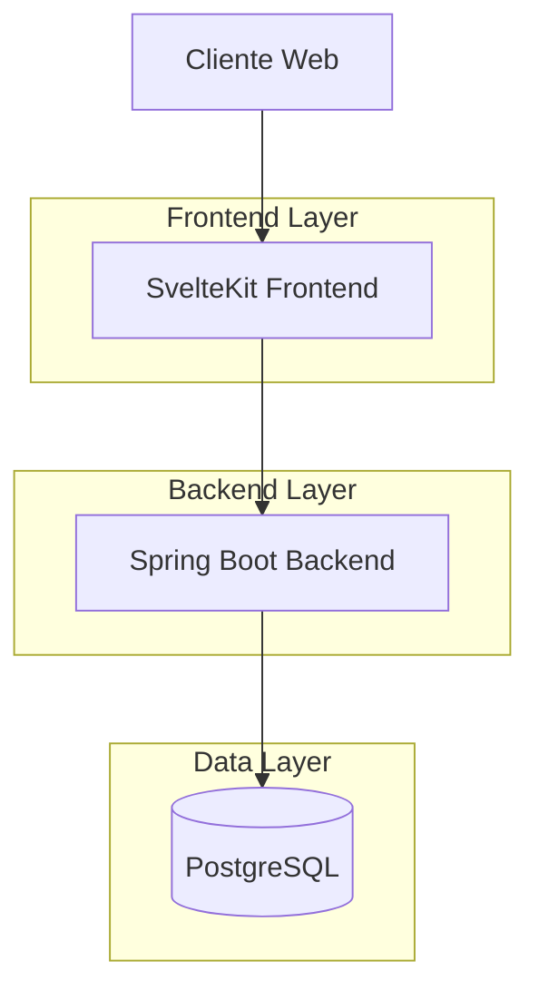
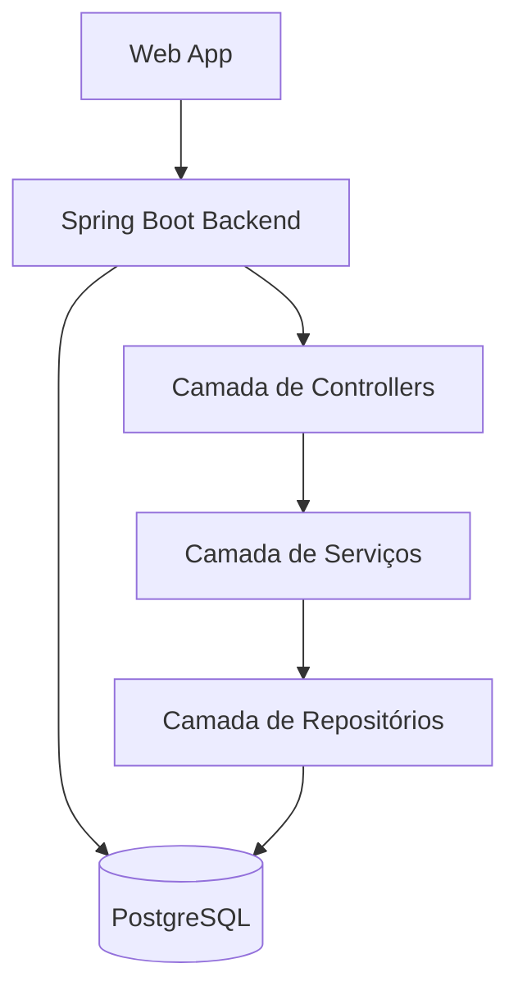
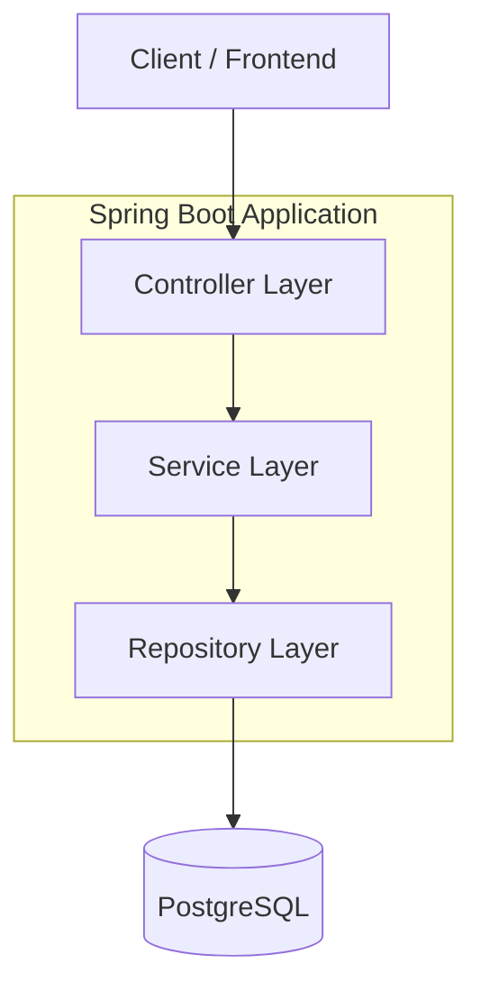
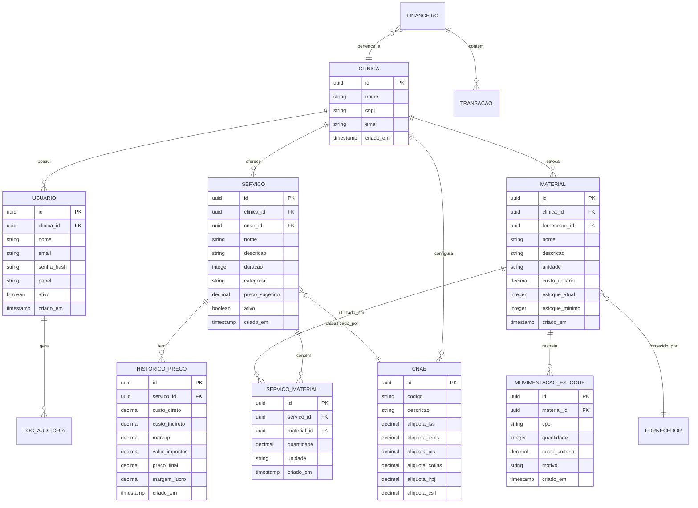
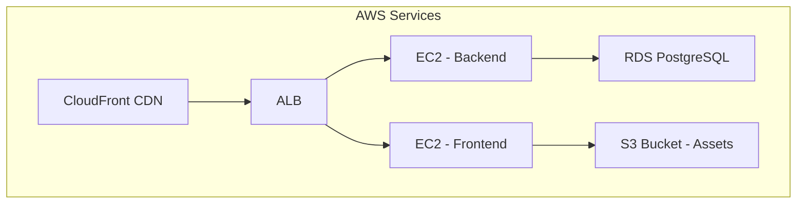

# Finesse Centro Integrado - Documento de Arquitetura Técnica

## 1. Arquitetura do Sistema

### 1.1 Arquitetura Geral



### 1.2 Arquitetura de Camadas



## 2. Stack Tecnológica

### 2.1 Tecnologias Principais

* **Backend**: Java 21 + Spring Boot 3.2 (Web, Validation, Security, Data JPA)
**Frontend**: SvelteKit 2.0 + TypeScript 5.0 + Vite
**Banco de Dados**: PostgreSQL 15
**Autenticação**: Spring Security + JWT
**Container**: Docker + Docker Compose
**Testes**: JUnit 5 + Mockito
**Build**: Maven
**Futuro**: AWS (EC2/Elastic Beanstalk + S3/CloudFront)

### 2.2 Dependências Essenciais

**Frontend:**
* @sveltejs/kit: Framework web moderno
* tailwindcss: Estilização utilitária
* lucide-svelte: Ícones consistentes
* chart.js: Visualização de dados
* axios: Cliente HTTP

**Backend:**
* spring-boot-starter-web: API REST
* spring-boot-starter-data-jpa: ORM e persistência
* spring-boot-starter-security: Segurança e autenticação
* spring-boot-starter-validation: Validação de dados
* postgresql: Driver PostgreSQL
* jjwt: JWT tokens
* spring-boot-starter-test: Testes

## 3. Definições de Rotas

### 3.1 Rotas Frontend (SvelteKit)

| Rota             | Propósito                               |
| ---------------- | --------------------------------------- |
| /                | Dashboard principal com indicadores     |
| /login           | Página de autenticação de usuários      |
| /servicos        | Gestão de serviços da clínica           |
| /servicos/\[id]  | Detalhes e edição de serviço específico |
| /materiais       | Controle de materiais e estoque         |
| /materiais/\[id] | Detalhes do material e movimentações    |
| /precificacao    | Cálculo de precificação e markup        |
| /financeiro      | Relatórios financeiros e DRE            |
| /configuracoes   | Configurações da clínica e CNAE         |
| /relatorios      | Relatórios gerenciais e exportações     |

### 3.2 Rotas Backend API (Spring Boot)

| Rota                       | Método         | Descrição                       |
| -------------------------- | -------------- | ------------------------------- |
| /api/auth/login            | POST           | Autenticação de usuário         |
| /api/auth/refresh          | POST           | Renovação de token JWT          |
| /api/users                 | GET/POST       | Gerenciamento de usuários       |
| /api/servicos              | GET/POST       | CRUD de serviços                |
| /api/servicos/\[id]        | GET/PUT/DELETE | Operações em serviço específico |
| /api/materiais             | GET/POST       | CRUD de materiais               |
| /api/materiais/\[id]/estoque | PUT        | Atualização de estoque          |
| /api/precificacao/calcular | POST           | Cálculo de preço com markup     |
| /api/financeiro/relatorios | GET            | Relatórios financeiros          |
| /api/cnae                  | GET/POST       | Configuração de CNAE            |
| /api/relatorios/exportar   | POST           | Exportação de relatórios        |

## 4. Especificações de API

### 4.1 Autenticação

**Login Request:**

```json
{
  "email": "usuario@clinica.com",
  "password": "senha123",
  "clinicId": "uuid-da-clinica"
}
```

**Login Response:**

```json
{
  "accessToken": "eyJhbGciOiJIUzI1NiIsInR5cCI6IkpXVCJ9...",
  "refreshToken": "eyJhbGciOiJIUzI1NiIsInR5cCI6IkpXVCJ9...",
  "user": {
    "id": "uuid-usuario",
    "name": "João Silva",
    "role": "OWNER",
    "permissions": ["READ", "WRITE", "ADMIN"]
  },
  "expiresIn": 3600
}
```

### 4.2 Serviços

**Requisição de Serviço:**

```json
{
  "nome": "Limpeza de Pele",
  "descricao": "Limpeza profunda da pele com extração de cravos",
  "duracao": 60,
  "categoria": "ESTETICA",
  "materiais": [
    {
      "materialId": "uuid-material-1",
      "quantidade": 2.5,
      "unidade": "ml"
    }
  ],
  "codigoCnae": "9609-2/01"
}
```

**Resposta de Precificação:**

```json
{
  "servicoId": "uuid-servico",
  "custoDireto": 45.50,
  "custoIndireto": 25.00,
  "custoTotal": 70.50,
  "markup": 49.35,
  "valorImpostos": 15.88,
  "precoSugerido": 135.73,
  "margemLucro": 35.0
}
```

### 4.3 Materiais

**Requisição de Material:**

```json
{
  "nome": "Ácido Glicólico",
  "descricao": "Ácido glicólico 70% para peeling",
  "unidade": "ml",
  "custoUnitario": 8.50,
  "estoqueAtual": 100,
  "estoqueMinimo": 20,
  "fornecedor": {
    "nome": "Laboratório ABC",
    "cnpj": "12.345.678/0001-90",
    "contato": "contato@lababc.com"
  }
}
```

## 5. Arquitetura do Servidor

### 5.1 Camadas da Arquitetura



### 5.2 Estrutura de Pacotes

```
com.finesse.clinic/
├── config/
│   ├── SecurityConfig.java
│   ├── JwtConfig.java
│   └── DatabaseConfig.java
├── controller/
│   ├── AuthController.java
│   ├── ServiceController.java
│   ├── MaterialController.java
│   ├── PricingController.java
│   └── FinancialController.java
├── service/
│   ├── AuthService.java
│   ├── ServiceService.java
│   ├── MaterialService.java
│   ├── PricingService.java
│   └── FinancialService.java
├── repository/
│   ├── UserRepository.java
│   ├── ServiceRepository.java
│   ├── MaterialRepository.java
│   └── FinancialRepository.java
├── model/
│   ├── User.java
│   ├── Service.java
│   ├── Material.java
│   └── Clinic.java
├── dto/
│   ├── LoginRequest.java
│   ├── ServiceRequest.java
│   └── PricingResponse.java
├── security/
│   ├── JwtTokenProvider.java
│   ├── CustomUserDetails.java
│   └── JwtAuthenticationFilter.java
└── exception/
    ├── GlobalExceptionHandler.java
    ├── BusinessException.java
    └── ResourceNotFoundException.java
```

## 6. Modelo de Dados

### 6.1 Diagrama ER



### 6.2 DDL - Definições de Tabela

**Tabela Clinicas:**

```sql
CREATE TABLE clinicas (
    id UUID PRIMARY KEY DEFAULT gen_random_uuid(),
    nome VARCHAR(255) NOT NULL,
    cnpj VARCHAR(14) UNIQUE NOT NULL,
    email VARCHAR(255) UNIQUE NOT NULL,
    telefone VARCHAR(20),
    endereco TEXT,
    criado_em TIMESTAMP WITH TIME ZONE DEFAULT NOW(),
    atualizado_em TIMESTAMP WITH TIME ZONE DEFAULT NOW()
);
```

**Tabela Usuarios:**

```sql
CREATE TABLE usuarios (
    id UUID PRIMARY KEY DEFAULT gen_random_uuid(),
    clinica_id UUID NOT NULL REFERENCES clinicas(id) ON DELETE CASCADE,
    nome VARCHAR(255) NOT NULL,
    email VARCHAR(255) UNIQUE NOT NULL,
    senha_hash VARCHAR(255) NOT NULL,
    papel VARCHAR(50) NOT NULL CHECK (papel IN ('PROPRIETARIO', 'ADMINISTRADOR', 'FUNCIONARIO')),
    ativo BOOLEAN DEFAULT true,
    criado_em TIMESTAMP WITH TIME ZONE DEFAULT NOW(),
    atualizado_em TIMESTAMP WITH TIME ZONE DEFAULT NOW()
);

CREATE INDEX idx_usuarios_clinica_id ON usuarios(clinica_id);
CREATE INDEX idx_usuarios_email ON usuarios(email);
```

**Tabela Servicos:**

```sql
CREATE TABLE servicos (
    id UUID PRIMARY KEY DEFAULT gen_random_uuid(),
    clinica_id UUID NOT NULL REFERENCES clinicas(id) ON DELETE CASCADE,
    cnae_id UUID REFERENCES cnae(id),
    nome VARCHAR(255) NOT NULL,
    descricao TEXT,
    duracao INTEGER NOT NULL, -- em minutos
    categoria VARCHAR(100) NOT NULL,
    preco_sugerido DECIMAL(10,2),
    ativo BOOLEAN DEFAULT true,
    criado_em TIMESTAMP WITH TIME ZONE DEFAULT NOW(),
    atualizado_em TIMESTAMP WITH TIME ZONE DEFAULT NOW()
);

CREATE INDEX idx_servicos_clinica_id ON servicos(clinica_id);
CREATE INDEX idx_servicos_categoria ON servicos(categoria);
```

**Tabela Materiais:**

```sql
CREATE TABLE materiais (
    id UUID PRIMARY KEY DEFAULT gen_random_uuid(),
    clinica_id UUID NOT NULL REFERENCES clinicas(id) ON DELETE CASCADE,
    fornecedor_id UUID REFERENCES fornecedores(id),
    nome VARCHAR(255) NOT NULL,
    descricao TEXT,
    unidade VARCHAR(50) NOT NULL,
    custo_unitario DECIMAL(10,2) NOT NULL,
    estoque_atual INTEGER NOT NULL DEFAULT 0,
    estoque_minimo INTEGER NOT NULL DEFAULT 0,
    ativo BOOLEAN DEFAULT true,
    criado_em TIMESTAMP WITH TIME ZONE DEFAULT NOW(),
    atualizado_em TIMESTAMP WITH TIME ZONE DEFAULT NOW()
);

CREATE INDEX idx_materiais_clinica_id ON materiais(clinica_id);
CREATE INDEX idx_materiais_fornecedor_id ON materiais(fornecedor_id);
```

**CNAE Table:**

```sql
CREATE TABLE cnae (
    id UUID PRIMARY KEY DEFAULT gen_random_uuid(),
    code VARCHAR(20) UNIQUE NOT NULL,
    description TEXT NOT NULL,
    iss_rate DECIMAL(5,2) DEFAULT 0, -- percentual
    icms_rate DECIMAL(5,2) DEFAULT 0,
    pis_rate DECIMAL(5,2) DEFAULT 0,
    cofins_rate DECIMAL(5,2) DEFAULT 0,
    irpj_rate DECIMAL(5,2) DEFAULT 0,
    csll_rate DECIMAL(5,2) DEFAULT 0,
    active BOOLEAN DEFAULT true,
    created_at TIMESTAMP WITH TIME ZONE DEFAULT NOW()
);

-- Inserir CNAE comuns
INSERT INTO cnae (code, description, iss_rate, pis_rate, cofins_rate, irpj_rate, csll_rate) VALUES
('9609-2/01', 'Estética e atividades de complementação estética', 5.0, 0.65, 3.0, 1.5, 1.0),
('9609-2/02', 'Atividades de estética médica', 2.0, 0.65, 3.0, 1.5, 1.0),
('86.90-6/01', 'Serviços médicos não especificados', 0.0, 0.65, 3.0, 1.5, 1.0);
```

## 7. Segurança

### 7.1 Autenticação JWT

```java
@Component
public class JwtTokenProvider {
    
    @Value("${jwt.secret}")
    private String jwtSecret;
    
    @Value("${jwt.expiration}")
    private int jwtExpiration;
    
    public String generateToken(User user) {
        Map<String, Object> claims = new HashMap<>();
        claims.put("clinicId", user.getClinic().getId());
        claims.put("role", user.getRole());
        
        return Jwts.builder()
            .setClaims(claims)
            .setSubject(user.getEmail())
            .setIssuedAt(new Date())
            .setExpiration(new Date(System.currentTimeMillis() + jwtExpiration))
            .signWith(SignatureAlgorithm.HS512, jwtSecret)
            .compact();
    }
}
```

### 7.2 Autorização por Role

```java
@Configuration
@EnableWebSecurity
public class SecurityConfig {
    
    @Override
    protected void configure(HttpSecurity http) throws Exception {
        http
            .authorizeRequests()
                .antMatchers("/api/auth/**").permitAll()
                .antMatchers("/api/admin/**").hasRole("ADMIN")
                .antMatchers("/api/services/**").hasAnyRole("OWNER", "ADMIN", "EMPLOYEE")
                .antMatchers("/api/materials/**").hasAnyRole("OWNER", "ADMIN")
                .antMatchers("/api/pricing/**").hasAnyRole("OWNER", "ADMIN")
                .anyRequest().authenticated()
            .and()
            .addFilterBefore(jwtAuthenticationFilter, UsernamePasswordAuthenticationFilter.class);
    }
}
```

## 8. Frontend Architecture (SvelteKit)

### 8.1 Estrutura de Diretórios

```
src/
├── routes/
│   ├── (auth)/
│   │   ├── login/
│   │   │   └── +page.svelte
│   │   └── register/
│   │       └── +page.svelte
│   ├── (app)/
│   │   ├── dashboard/
│   │   │   └── +page.svelte
│   │   ├── services/
│   │   │   ├── +page.svelte
│   │   │   └── [id]/
│   │   │       └── +page.svelte
│   │   ├── materials/
│   │   │   ├── +page.svelte
│   │   │   └── [id]/
│   │   │       └── +page.svelte
│   │   └── pricing/
│   │       └── +page.svelte
├── lib/
│   ├── components/
│   │   ├── ui/
│   │   │   ├── Button.svelte
│   │   │   ├── Input.svelte
│   │   │   ├── Table.svelte
│   │   │   └── Card.svelte
│   │   ├── layout/
│   │   │   ├── Header.svelte
│   │   │   ├── Sidebar.svelte
│   │   │   └── Footer.svelte
│   │   └── charts/
│   │       ├── RevenueChart.svelte
│   │       └── ProfitChart.svelte
│   ├── stores/
│   │   ├── auth.js
│   │   ├── clinic.js
│   │   └── theme.js
│   ├── utils/
│   │   ├── api.js
│   │   ├── validators.js
│   │   └── formatters.js
│   └── constants/
│       └── index.js
└── styles/
    └── app.css
```

### 8.2 Componentes Principais

**ServiceCard.svelte:**

```svelte
<script>
  export let service;
  export let onEdit;
  export let onDelete;
</script>

<Card class="hover:shadow-lg transition-shadow">
  <div class="p-6">
    <h3 class="text-lg font-semibold text-gray-900">{service.name}</h3>
    <p class="text-gray-600 mt-2">{service.description}</p>
    <div class="mt-4 flex justify-between items-center">
      <span class="text-2xl font-bold text-blue-600">
        R$ {service.suggestedPrice?.toFixed(2)}
      </span>
      <div class="space-x-2">
        <Button variant="outline" on:click={() => onEdit(service)}>
          Editar
        </Button>
        <Button variant="destructive" on:click={() => onDelete(service)}>
          Excluir
        </Button>
      </div>
    </div>
  </div>
</Card>
```

## 9. Deploy e Infraestrutura

### 9.1 Docker Configuration

**Dockerfile (Backend):**

```dockerfile
FROM openjdk:21-jdk-slim

WORKDIR /app

COPY target/clinic-service-*.jar app.jar

EXPOSE 8080

ENV JAVA_OPTS="-Xms512m -Xmx2048m"

ENTRYPOINT ["java", "-jar", "app.jar"]
```

**Dockerfile (Frontend):**

```dockerfile
FROM node:20-alpine AS builder

WORKDIR /app

COPY package*.json ./
RUN npm ci

COPY . .
RUN npm run build

FROM nginx:alpine

COPY --from=builder /app/build /usr/share/nginx/html
COPY nginx.conf /etc/nginx/nginx.conf

EXPOSE 80

CMD ["nginx", "-g", "daemon off;"]
```

### 9.2 Docker Compose

```yaml
version: '3.8'

services:
  postgres:
    image: postgres:15
    environment:
      POSTGRES_DB: finesse_clinic
      POSTGRES_USER: clinic_user
      POSTGRES_PASSWORD: ${DB_PASSWORD}
    volumes:
      - postgres_data:/var/lib/postgresql/data
      - ./init.sql:/docker-entrypoint-initdb.d/init.sql
    ports:
      - "5432:5432"
    networks:
      - clinic-network

  backend:
    build: ./backend
    ports:
      - "8080:8080"
    environment:
      SPRING_DATASOURCE_URL: jdbc:postgresql://postgres:5432/finesse_clinic
      SPRING_DATASOURCE_USERNAME: clinic_user
      SPRING_DATASOURCE_PASSWORD: ${DB_PASSWORD}
      JWT_SECRET: ${JWT_SECRET}
    depends_on:
      - postgres
    networks:
      - clinic-network

  frontend:
    build: ./frontend
    ports:
      - "3000:80"
    depends_on:
      - backend
    networks:
      - clinic-network

volumes:
  postgres_data:

networks:
  clinic-network:
    driver: bridge
```

### 9.3 AWS Architecture (Futuro)



## 10. Monitoramento e Observabilidade

### 10.1 Logs e Métricas

* **Application Logs**: Structured logging com Logback
* **Metrics**: Micrometer com Prometheus
* **Health Checks**: Spring Boot Actuator

### 10.2 Testes

* **Unit Tests**: JUnit 5 + Mockito
* **Integration Tests**: Spring Boot Test
* **Test Coverage**: Mínimo 80%